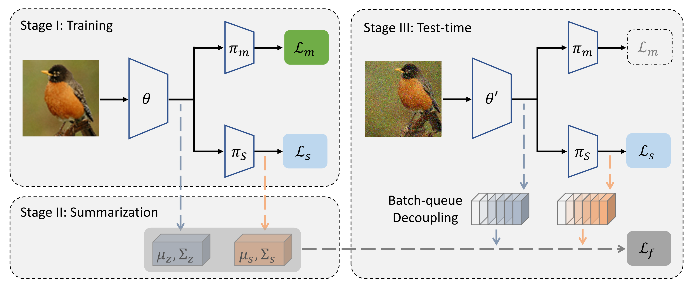

# TTT++

This is an official implementation for the paper

**[TTT++: When Does Self-supervised Test-time Training Fail or Thrive? @ NeurIPS 2021](https://papers.nips.cc/paper/2021/hash/b618c3210e934362ac261db280128c22-Abstract.html)**
<br>
<a href="https://sites.google.com/view/yuejiangliu/">Yuejiang Liu</a>,
<a href="https://thedebugger811.github.io/">Parth Kothari</a>,
<a href="https://people.epfl.ch/bastien.vandelft?lang=en">Bastien van Delft</a>,
<a href="https://www.linkedin.com/in/baptiste-bellot-gurlet-9ba170131/">Baptiste Bellot-Gurlet</a>,
<a href="https://people.epfl.ch/taylor.mordan?lang=en">Taylor Mordan</a>,
<a href="https://people.epfl.ch/alexandre.alahi/?lang=en/">Alexandre Alahi</a>
<br>

TL;DR: Online Feature Alignment + Strong Self-supervised Learner &#129138; Robust Test-time Adaptation 

* Results
	* reveal limitations and promise of TTT, with evidence through synthetic simulations
	* our proposed TTT++ yields state-of-the-art results on visual robustness benchmarks
* Takeaways
	* both task-specific (e.g. related SSL) and model-specific (e.g. feature moments) info are crucial
	* need to rethink what (and how) to store, in addition to model parameters, for robust deployment

<p align="center">
  
</p>

### Synthetic

Please check out the code in the [synthetic](synthetic) folder.

### CIFAR10/100

Please check out the code in the [cifar](cifar) folder.

### Citation

If you find this code useful for your research, please cite our paper:

```bibtex
@inproceedings{liu2021ttt++,
  title={TTT++: When Does Self-Supervised Test-Time Training Fail or Thrive?},
  author={Liu, Yuejiang and Kothari, Parth and van Delft, Bastien Germain and Bellot-Gurlet, Baptiste and Mordan, Taylor and Alahi, Alexandre},
  booktitle={Thirty-Fifth Conference on Neural Information Processing Systems},
  year={2021}
}
```


### Contact

yuejiang [dot] liu [at] epfl [dot] ch