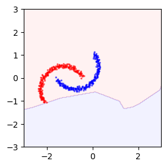
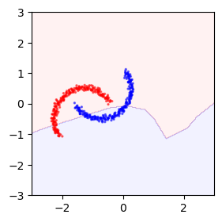

# TTT++ Synthetic

TTT++ on the synthetic [inter-twinning two moons](https://scikit-learn.org/stable/modules/generated/sklearn.datasets.make_moons.html) problem.

## Requirements

To install requirements:

```bash
pip install -r requirements.txt
```

## Quick Comparison

To quickly compare the [TTT](https://proceedings.mlr.press/v119/sun20b.html) and our [TTT++](https://papers.nips.cc/paper/2021/hash/b618c3210e934362ac261db280128c22-Abstract.html) quantitatively, run the following line:
```
python main.py
```

To visualize the results, run the following line:
```
python main.py --figdir=docs
```

## Sample Results

### Quantitative

| Model      |   IID    |  Test    |  Vanilla TTT   |      TENT     |      SHOT     |   Our TTT++   |
|:----------:|:--------:|:--------:|:--------------:|:-------------:|:-------------:|:-------------:|
| Accuracy   |  100.0%  |  50.0%   |     50.0%      |      50%      |     67.8%     |     88.2%     |

### Qualitative

|      IID      |      Test     |  Vanilla TTT  |      TENT     |      SHOT     |   Our TTT++   |
|:-------------:|:-------------:|:-------------:|:-------------:|:-------------:|:-------------:|
 |  |  |  |  |  |

## Other Settings

The detailed problem setting can be controlled as follows:
- distributional shift between training and test: translation `--tran` and/or rotation `--rot` of all data points,
- label agreement between the main and SSL task: interleaving distance `--sep` between the two moons.
```
python main.py --tran=<translation> --rot=<rotation> --sep=<distance>
```

To recurrent the results shown in the report, run experiments by the following line:
```
python experiment.py
```
The performance of the four methods under various domain shift:

